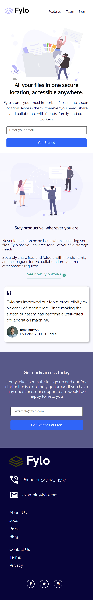

# Fylo-landing-Page-With-Two-Column-Layout

# Frontend Mentor - Fylo landing page with two column layout solution

This is a solution to the [Fylo landing page with two column layout challenge on Frontend Mentor](https://www.frontendmentor.io/challenges/fylo-landing-page-with-two-column-layout-5ca5ef041e82137ec91a50f5). Frontend Mentor challenges help you improve your coding skills by building realistic projects. 

## Table of contents

- [Overview](#overview)
  - [The challenge](#the-challenge)
  - [Screenshot](#screenshot)
  - [Links](#links)
- [My process](#my-process)
  - [Built with](#built-with)
  - [Continued development](#continued-development)
  - [Useful resources](#useful-resources)
- [Author](#author)
- [Acknowledgments](#acknowledgments)

**Note: Delete this note and update the table of contents based on what sections you keep.**

## Overview

### The challenge

Users should be able to:

- View the optimal layout for the site depending on their device's screen size
- See hover states for all interactive elements on the page

### Screenshot

### Links

- Solution URL: [Github Code Link](https://github.com/AmanGupta1703/Fylo-landing-Page-With-Two-Column-Layout)
- Live Site URL: [GitHub Live Page](https://amangupta1703.github.io/Fylo-landing-Page-With-Two-Column-Layout/)

## My process

### Built with

- Semantic HTML5 markup
- CSS custom properties
- Flexbox

### Continued development

1) SASS
2) Responsive Design

### Useful resources

- [Net Ninja](https://www.youtube.com/c/TheNetNinja)

## Author

- Website - [Fylo landing page with two column layout](https://amangupta1703.github.io/Fylo-landing-Page-With-Two-Column-Layout/)
- Frontend Mentor - [@AmanGupta1703](https://www.frontendmentor.io/profile/AmanGupta1703)
